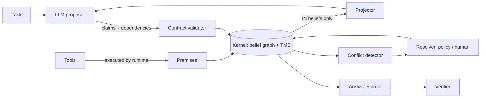

<div align="center">

# Corollary

**An agent runtime where the unit of state is a belief, not a message.**

Every conclusion your agent reaches carries its proof.
Correct one fact, and everything that followed from it updates itself.

[](https://github.com/gabe-santana/corollary/actions/workflows/ci.yml)
[](#roadmap)
[](LICENSE)
[](#installation)
[](pyproject.toml)
[](CONTRIBUTING.md)

[Documentation](docs/index.md) · [Getting started](docs/getting-started.md) · [Examples](examples/) · [Contributing](CONTRIBUTING.md)

<br>


</div>

---

> ⚠️ **Corollary is pre-alpha.** The v0.1 kernel and agent runtime are implemented and tested, and most of
> v0.2 and v0.3 are in. Interfaces may still change before 1.0. If the idea resonates, star the repo, open
> an issue, or help shape the belief schema.

## Why "Corollary"

In mathematics, a corollary is a result that follows directly from something already proven. It stands only as long as the theorem behind it stands.

That is the contract Corollary enforces for AI agents: every conclusion must follow from evidence, and when the evidence falls, the conclusion falls with it.

## The problem

Every agent framework today stores state the same way: as a **message log**. A chat transcript, growing step by step.

That single design choice is why long-running agents rot:

- A hallucination at step 3 is just text. At step 40 the agent reads it with the same trust as a verified tool result.
- Nobody can answer *why* the agent believes something without re-reading the entire transcript.
- When one input turns out to be wrong, the only fix is to re-run everything, or hope a human catches every downstream mistake.
- Two sources disagree, and the model silently picks one. You never learn there was a conflict.

Better models reduce these failures. They cannot eliminate them, because the problem isn't the model. It's the data structure.

## The idea

Corollary replaces the message log with a **belief base**.

A belief is a claim plus everything needed to trust it:

```text
Belief
├── claim          "Q3 revenue grew 4.65% over Q2"
├── confidence     0.92
├── source         tool:sec_filings  |  model:any-llm  |  human:alice
├── valid_until    2026-12-31
└── follows_from   [ belief:revenue_Q2, belief:revenue_Q3, rule:growth ]
```

Underneath sits a **Truth Maintenance System** (Doyle, 1979): every belief records what supports it, and when that support is withdrawn, dependent beliefs are retracted automatically. A message log still exists, but only as a *view* derived from the belief base, never as the source of truth.

Truth maintenance never took off for general reasoning because humans had to write every justification by hand. LLMs can now propose them at scale. That was the missing piece.

## What this unlocks

**Retraction cascades.** A tool returns a corrected figure. Every conclusion derived from the old value is retracted and re-derived, surgically. You fix one fact, not a transcript.

**Contradictions as first-class objects.** When evidence conflicts, Corollary raises a `Conflict` carrying both support chains instead of letting the model guess. Resolve it by policy, by source rank, or by asking a human.

**Proof-carrying answers.** Every answer ships with its proof: the graph of beliefs it follows from. A deterministic verifier checks it. Cited spans exist, arithmetic re-executes, dates are consistent, and every leaf traces back to a tool, a document, or a person. Trust moves from the model to the proof.

**Beliefs that expire.** A stock price is valid for a minute; a company's headquarters for a year. Stale beliefs trigger re-verification instead of silent reuse.

**Trust that is earned.** Every source, the model included, is trusted as much as its track record justifies. When a source is shown to be wrong, everything it reported counts for less. Independent sources that agree reinforce each other. See [Confidence](docs/guides/confidence.md).

**Auditable memory.** New sessions inherit verified beliefs with their proofs attached, not raw transcripts.

**Multi-agent by argument** *(planned)*. Agents exchange beliefs with their support. The receiver can accept, reject, or demand proof.

## A taste of the API

```python
from corollary import Agent, BeliefBase, tool

kb = BeliefBase()


@tool(trust="high")
def get_revenue(quarter: str) -> float:
    """Quarterly revenue in USD from SEC filings."""
    ...


agent = Agent(model="anthropic:claude-opus-5-5", beliefs=kb, tools=[get_revenue])

report = agent.run("Compare Q2 and Q3 revenue and assess the growth trend.")

print(report.answer)
print(report.proof)  # the graph of beliefs the answer follows from
report.verify()  # deterministic checks over the proof
```

Now an upstream figure is corrected:

```python
kb.retract("revenue:Q2", reason="restated in 10-K/A")
kb.assert_("revenue:Q2", 4.1e9, source="tool:get_revenue")

for change in agent.repair():
    print(change)
# OUT  revenue:Q2          (retracted: restated in 10-K/A)
# OUT  growth:Q3_vs_Q2     (lost support: revenue:Q2)
# OUT  trend:Q3            (lost support: revenue:Q2, growth:Q3_vs_Q2)
# OUT  answer              (lost support: revenue:Q2, growth:Q3_vs_Q2, trend:Q3)
# IN   revenue:Q2          (asserted by tool:get_revenue)
# IN   growth:Q3_vs_Q2     (re-derived: 9.7561)
# IN   trend:Q3            (re-derived: 'strong')
# IN   answer              (re-derived: 'Q3 revenue grew 9.76% over Q2: strong growth.')

print(report.answer)  # the repaired answer
```

No re-run. No transcript archaeology. A diff of what changed. During repair, the model sees only the *current* inputs of each belief it re-derives. The retracted figure never reaches it again.

The kernel works without a model too. In [`examples/self_repairing_report.py`](examples/self_repairing_report.py), a 20-conclusion financial report repairs itself after a restatement: 12 conclusions change, 7 are never touched, the growth trend is recomputed, found unchanged, and stops the cascade, all in 13 rule evaluations and zero model calls.

## How it works

Corollary is not a system prompt asking a model to "track its reasoning." A prompt is a request; a model can ignore it. Every guarantee in Corollary is **enforced by code outside the model**.

The key inversion: **the model doesn't own the state, the runtime does.** The model is a stateless *proposer*. It never sees a transcript and never writes state directly. It receives a context built by the runtime and can only respond with structured claims, which the runtime validates before accepting.



**1. The kernel (pure code, no LLM).** A dependency graph plus a labeling algorithm. Each node is a belief; each edge is a justification. The kernel computes which beliefs are `IN` or `OUT` from the current graph. It is deterministic, fast, and testable like any data structure. Retraction walks only the affected region, so cost scales with the change, not the size of the base.

**2. The contract (structured output, enforced).** The model must answer in a schema: the claim, its value, and the IDs of the beliefs it follows from. The runtime rejects anything that doesn't parse or that depends on a belief that doesn't exist or is currently `OUT`. Tool calls go *through the runtime*, which executes them and records the results as premises itself. The model cannot fabricate a tool result.

**3. The projector (what makes retraction real).** Every model call receives a context assembled from `IN` beliefs only. When a belief is retracted it doesn't just get a flag; it disappears from everything the model can see. There is no transcript for a wrong fact to leak from. Forgetting is structural, not requested.

**4. The verifier.** Answers are exported with their proof and checked deterministically: arithmetic re-executes, citations are span-matched, temporal claims are checked for consistency.

### What is LLM and what is code

| The LLM does | Code does |
|---|---|
| Proposes claims | Records premises from tools, documents, humans |
| Chooses which tools to call | Executes tools and stores their results |
| Re-derives conclusions after a retraction | Validates every claim against the contract |
| | Verifies arithmetic, citations, dates |
| | Computes `IN` / `OUT` for every belief |
| | Builds every context window |
| | Cascades retractions |

Corollary doesn't make the model more honest. It makes the model's honesty irrelevant to whether bad facts propagate.

### The hard part, stated honestly

A model may declare that a conclusion depends on A when it also used B. Corollary handles this in layers:

- **Conservative default.** A claim is assumed to depend on *everything in the context it was generated from* (`dependencies="conservative"`). The projector guarantees the model could not have used anything else.
- **Narrowing by ablation.** `agent.narrow(key)` regenerates a claim with one belief removed from context at a time. If the answer doesn't change, that dependency is pruned.
- **Deterministic checks** on numeric and cited claims: formulas are re-executed, quotes are span-matched, and numbers that appear from nowhere are flagged.

The resulting guarantee is **over-retraction, never under-retraction**. You may occasionally re-derive something unnecessarily, but a retracted fact can never silently survive in a conclusion.

What code can't catch is listed too: see [limits, stated honestly](docs/architecture.md#limits-stated-honestly).

## Core concepts

| Concept | What it is |
|---|---|
| `Belief` | A claim with confidence, source, and revision. Its status (`IN` / `OUT`) is computed by the kernel. |
| `Justification` | A link from a set of antecedent beliefs (and optionally a rule or formula) to a conclusion. |
| `Premise` | A belief grounded directly in a tool, document span, or human. No antecedents. |
| `Rule` | A deterministic derivation, re-run automatically when its inputs change. |
| `Conflict` | Two `IN` beliefs that cannot both hold, with both support chains attached. |
| `Constraint` | An invariant over beliefs; a violation raises a `Conflict`. |
| `Proof` | The justification subgraph behind an answer. Exportable, verifiable, diffable. |
| `Projector` | Builds every model context from `IN` beliefs. |
| `TrustPolicy` | How much each source type is believed, and what is hidden from the model. |
| `TrustLedger` | Learns how reliable each source really is from its track record. |

Read more in [Core concepts](docs/concepts.md).

## How Corollary differs

| | Message-log agents | Memory layers | Prompted confidence scoring | **Corollary** |
|---|---|---|---|---|
| Unit of state | Message | Fact or summary | Annotated message | Belief with justifications |
| Knows *why* it believes X | ❌ | Source only | Self-reported | ✅ full derivation |
| Fix one input, update dependents | Re-run | Manual | ❌ | ✅ automatic cascade |
| Retracted facts removed from context | ❌ | ❌ | ❌ | ✅ enforced by projector |
| Surfaces contradictions | ❌ | May overwrite | ❌ | ✅ first-class `Conflict` |
| Verifiable output | ❌ | ❌ | ❌ | ✅ proof + deterministic verifier |
| Where guarantees live | — | Storage | The prompt | The runtime |

Corollary is not a memory plugin and not a prompting strategy. The belief base *is* the agent; memory, context, tool results and inter-agent messages are all projections of it. See [Related work](docs/related-work.md) for the prior art it builds on.

## Installation

Corollary requires Python 3.10+. The core has **no runtime dependencies**; model SDKs are optional extras.

```bash
pip install corollary                 # the kernel and the agent runtime
pip install "corollary[anthropic]"    # + the Claude adapter (official Anthropic SDK)
pip install "corollary[openai]"       # + the OpenAI-compatible adapter
```

To develop:

```bash
git clone https://github.com/gabe-santana/corollary.git
cd corollary
pip install -e ".[dev]"
pytest
```

Then follow [Getting started](docs/getting-started.md), or run an example. Neither of the first two needs an API key:

```bash
python examples/self_repairing_report.py   # 20 conclusions repair themselves, zero model calls
python examples/agent_offline.py           # a full agent run with a scripted model
python examples/agent_claude.py            # the same with Claude (needs ANTHROPIC_API_KEY)
python examples/agent_ollama.py            # the same with a local Ollama model
```

## Documentation

| | |
|---|---|
| [Getting started](docs/getting-started.md) | Install, a self-repairing belief base, an offline agent, Claude |
| [Core concepts](docs/concepts.md) | Beliefs, revisions, justifications, labels, confidence, conflicts, proofs |
| [Guides](docs/guides/) | [Belief base](docs/guides/belief-base.md) · [Agents](docs/guides/agents.md) · [Contract](docs/guides/contract.md) · [Verification](docs/guides/verification.md) · [Conflicts](docs/guides/conflicts.md) · [Documents](docs/guides/documents.md) · [Time](docs/guides/time.md) · [Models](docs/guides/models.md) · [Persistence](docs/guides/persistence.md) |
| [Architecture and guarantees](docs/architecture.md) | How the kernel works, what is guaranteed, and the limits |
| [API reference](docs/api.md) | Every public class and method |
| [FAQ](docs/faq.md) | Quick answers |

## Roadmap

**v0.1: the kernel** ✅
- [x] `Belief`, `Justification`, `BeliefBase` with JTMS labeling and retraction
- [x] Claim contract (structured output) with model-agnostic adapters
- [x] Runtime-executed tools that emit premises
- [x] Projector: context built from `IN` beliefs only
- [x] Flagship demo: a 20-conclusion research report that repairs itself when one input is corrected

**v0.2: proof and verification**
- [x] Deterministic verifiers: arithmetic re-execution, citation spans, temporal consistency
- [x] Proof export (JSON, Mermaid, Graphviz)
- [ ] Interactive proof graph viewer
- [x] Ablation-based dependency narrowing
- [x] Conflict detection and pluggable resolvers

**v0.3: time and memory**
- [x] Validity windows and automatic re-verification of stale beliefs
- [x] Persistent belief snapshots (JSON)
- [ ] Persistent belief stores (SQLite, Postgres)
- [ ] Cross-session inheritance policies for verified beliefs

**v0.4: many agents**
- [ ] Belief exchange protocol: accept / reject / demand proof
- [ ] Assumption-based (ATMS) mode for exploring alternative hypotheses in parallel
- [ ] MCP server so any agent can use a Corollary belief base

## Open problems we want help with

These are the hard parts. Each one is a research contribution waiting to happen.

- **Confabulated dependencies.** How cheaply can we detect a declared dependency the model didn't actually use?
- **Granularity.** Too fine and the graph explodes; too coarse and cascades become blunt. What is the right atomic claim?
- **Equivalence.** When are two differently worded claims the same belief?
- **Developer experience.** It has to feel as simple as appending to a message list, or nobody will switch.
- **Benchmarks.** There is no standard evaluation for how well an agent recovers from a corrected input. We want to build one.

## Contributing

Corollary is in the design phase, which is the best time to shape it. Good first contributions:

- Comment on the belief schema in [Discussions](https://github.com/gabe-santana/corollary/discussions)
- Propose a demo scenario from your domain (finance, law, science, operations)
- Implement a [verifier](docs/guides/verification.md#writing-a-check)
- Write a [model adapter](docs/guides/models.md#writing-an-adapter) for your favorite provider

See [CONTRIBUTING.md](CONTRIBUTING.md) to get started. Everyone taking part is expected to follow the [Code of Conduct](CODE_OF_CONDUCT.md). To report a vulnerability, see [SECURITY.md](SECURITY.md).

## Background

Corollary stands on decades of work in knowledge representation:

- Jon Doyle, *A Truth Maintenance System* (1979)
- Johan de Kleer, *An Assumption-based TMS* (1986)
- Alchourrón, Gärdenfors & Makinson, the AGM theory of belief revision (1985)

What's new is the pairing: classical reason maintenance as the kernel, LLMs as the engine that proposes beliefs and justifications at scale.

## License

MIT. See [LICENSE](LICENSE). You can use, modify and distribute Corollary freely, including in commercial and closed-source projects.

---

<div align="center">

**Agents shouldn't just conclude. Their conclusions should follow.**

</div>
